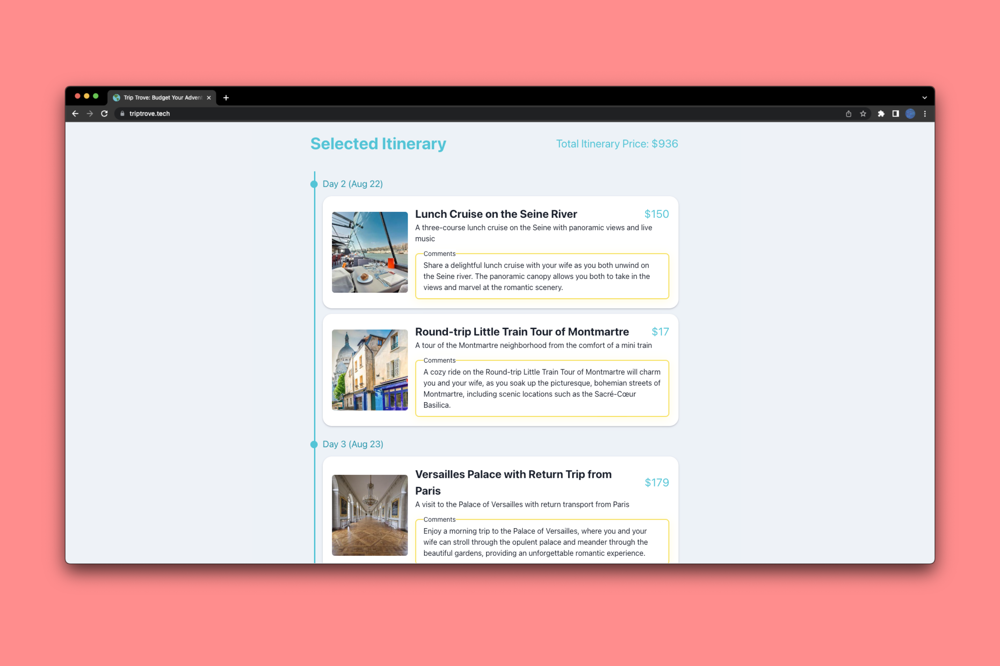

## TripTrove



TripTrove is an application that generates a personalized travel plan based on a user's budget, dream destination, requirements, geographical location, and more! It provides plane tickets, hotels, and an itinerary (of real attractions!) for each day of your trip. Finally, it comments on why a specific attraction is perfect for you! Submission for [Wafflehacks 2023](https://wafflehacks-2023.devpost.com/).

**Try it at [triptove.tech](https://triptrove.tech)!**

### Usage

Frontend development:
```bash
cd frontend
yarn # install dependencies
yarn dev
```

Backend development:
```bash
cd server
python3 -m pip install -r requirements.txt # install dependencies
uvicorn server:app --reload
```
